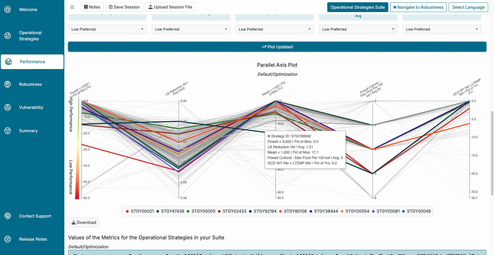

```{r setup, include=FALSE}
knitr::opts_chunk$set(echo = FALSE)
```

{width="100%"}

# Overview

This is a walk-through of the work that I did on the Colorado River Basin Post-2026 Operations Exploration Tool while working on the Virga Labs team from July of 2022 through May of 2024. This tool was built for the U.S. Bureau of Reclamation to allow Colorado River Basin stakeholders and the public to explore operational strategies for Lake Powell and Lake Mead as part of the Post-2026 National Environmental strategy Act (NEPA) Process. This tool is intended to support early-stage exploration of operational strategies that may eventually be incorporated into the Post-2026 NEPA alternatives. A link to the tool itself can be found [here](https://www.crbpost2026dmdu.org/), and it can be explored by anyone that creates an account. This walk-through is more intended to showcase the work that I personally did while working on this project, and is less intended to showcase the whole tool itself. If you would like to learn more about the whole tool and what it is capable of, I recommending going to the website and making an account and exploring the tool for yourself!

## The Problem, The Solution, and The Data

This project uses data produced from a RiverWare model called CRSS (Colorado River Simulation System). This model is maintained and updated by the U.S. Bureau of Reclamation. This model allows people to feed in different inputs (hydrology, demand, initial conditions, and strategy, which is how the river is managed) and it will return predictive data for the river conditions over the next 60 years. This issue with this model is that the output data is a large amount of data tables that aren't very accessible for the average person. The Bureau of Reclamation wanted to make this data more accessible to the average stakeholder so that a large amount of people can all work together to figure out the best ways to manage the water over the next 60 years that make sense to as many stakeholders as possible, including the general public. So, this tool takes the output data of CRSS and builds many tools and visualizations that allow more people to get more out of it.

## My Auxilary Contrbutions

Before getting into the major sections of this project that I worked on I wanted to briefly touch on some of the smaller parts of this project that I helped out with. This project was built by a team of about 8 developers (give or take). This meant that I had the opportunity to do little bits of work through out this whole application.

<u><b>Here are some of the key skills that I was able to pick up while working on this project (with more description below):</b></u>

- RShiny front end development
- CSS
- HTML
- Javascript
- Nightly and weekly Deployments (manual and setting up CRON jobs)
- AWS 
  - Accessing data 
  - Creating EC2s and AMIs
  - Working with deployment

This is an RShiny web application (and a very large one at that) where I learned A LOT about front end RShiny development. Working on this project also gave me a lot of experience in UI/UX, CSS, HTML, and Javascript, since much of RShiny is wrapped around those languages, so in order to do certain customization, you need to use those languages. Once we began releasing versions of this app to the client and public, I was also responsible for nightly deployments to a dev environment and a weekly deployment to a production environment. Lastly, before diving deeper into my main accomplishments in this project, I also was able to learn a fair amount of working with AWS, be it accessing data, creating EC2s and AMIs for various environmental metrics that we used in the app, or working with deployments. 

# My Main Contributions

## Performance Tab

One area that I spent a lot of energy in was the performance tab of this application. Just to give a very simplified summary of the performance tab, it was used to show users how well their strategy (the way they chose to manage the river) performed against different metrics (some examples of these metrics are things such as energy production, money earned from recreation, Lake Mead and Lake Powell water levels, etc.) I helped with a lot of the UI organization on this tab as well as making changes to the Parallel Axis Plot when needed. The Performance Tab consisted of three subtabs, the tradeoff view, the trace view, and the metric explanations. 

### Tradeoff View

{width="100%"}

When the client requested to add different hydrologies to the tradeoff view so that users could see how their strategies performed in different potential hydrologic futures, I implemented the drop down that allows users to select which hydrology they wanted. 


Then, once a user has selected a hydrology, I hooked that up to our API to retrieve data for that specific hydrology. Once the API returned the correct data, I had it update the Parallel Axis Plot accordingly. This also included changes that needed to be updated in the Trace View tab, which I'll get into next.

<u><b>Summary of work done on the Tradeoff View tab:</b></u>

- Built in the functionality for users to select which hydrology to compare
  - Adding drop down
  - Hooking it up to API
  - Munge data to update the Parallel Axis Plot
- Other UI updates and fixes

### Trace View

{width="100%"}

The Trace View section of this application was one of my larger contributions. The Trace View is a more detailed explanation as to how each strategy gets its performance score for each metric. Within it, users can select the strategies, metrics, and hydrologies that they are interested in, query the database, and then get some insightful visualizations returned. When I first started working on this project the there was a very initial design for Trace View, but I ended up building the majority of it myself, from the UI/UX, to the data visualizations, to connecting everything with the APIs and the data. For UI/UX, the drop down menus weren't too difficult to implement in RShiny, but there were some other more difficult aspects of the Trace View UI. I had to implement a rank list for the selected strategies so that users can choose which order they want them to display in (in screen shot above). This used a package called sortable to create the list itself, but I had to do some hacky javascript to get the background colors of each item to match the designated color for that strategy. Once the user queried the database and the visualizations populated, I had to do some UI design to get each set of visualizations to show up in collapsible accordion boxes. Then within each box there were three different components to each strategy/metric combination, which took some work to get them to all fit appropriately. 

{width="100%"}

After the UI work, there was a lot of behind the scenes work that needed to be done with the data. When a user would select their inputs and click the "Calculate Traces" button, something had to happen. In order for something to happen I helped hook the button up to the API so that actual data would be retrieved, and then there was a lot of work that I did to get the data to produce the desired plots. Both the timeseries plots and the summary plots were created using the eCharts4r package which required a lot of Javascript to customize the plots to our needs. There is a highlighting functionality that is linked between the timeseries plots and the summary plots that required some difficult javascript to produce.

{width="100%"}

Then for the plots themselves. The data that would get returned from the API would be used to produce the timeseries plots and the summary plots. The timeseries plots look at 10 traces for each strategy and each metric. Those traces would then all be averaged to produce the summary plot, and then those values would all be averaged to get the final "score" for that metric. There is more details of this on the web app itself if you are interested in learning more. Each timeseries and summary plot would be different based on what the y-axis units were and if the timeseries data was either monthly or annual. This information would all be in the data that gets returned from the API. Once the data was returned from the API it would need to me munged based on different factors in order to fit into the plots that get produced, and I did the majority of that work as well. Lastly, all of the plots had custom hover over tool tips that needed to be created using custom javascript which I spent a lot of time working on and tweaking over time (seen in above image).

<u><b>Summary of work done on the Trace View tab:</b></u>

- Designed and implemented UI layout of whole tab
- Added drop downs to select inputs
- Used reactives and javascript to get the strategy colors to match in the sortable rank list
  - Made the rank list determine the order at which the strategies rendered on page
- Connected inputs to API to return correct data
- Munged data returned from API to properly produce plots
- Designed and coded all data visualizations (timeseries plots and summary plots) using eCharts4r and javascript
  - Used reactive values that would change the plot based on units, axis labels, and whether or not it was monthly or annual data
  - Used custom JS to get highlighting functionality to link between timeseries plots and summary plots
  - Used custom JS to customize all of the hover-over tool tips
  - Used reactives to get strategy colors to match individual plots

## Environemtnal Metrics

The next big task that I had on this project was implementing about 14 environmental metrics that users could compare their strategies with. There were already many other metrics in the tool, but later on in development the client asked that we add some more environmentally focused metrics that some of the users of the tool wanted, many of these being other governmental and environmental organizations. Some examples of the environmental metrics are things such as money earned through recreation in the Grand Canyon, small mouth bass populations, number of certain vegetation populations, etc. The way that the metrics work is when a user submits a new strategy it gets sent to the back-end and then it takes about 4 hours to run through our model and get the output data for each metric. So in order to implement new metrics we needed to run each strategy through some code that returns data for that new metric. The nice part is the agencies that wanted the new metrics were able to provide code for us that does all of the complex ecological calculations. So they passed their code to me, and then for each metric I had to tweak the code so that it could ingest our data format for all of the strategies, and then I would have to make the output data fit our back-end model, so that was a decent sized task. This also included doing data validation and making sure that the data that was being output was what we expected and checking with the experts from the other agencies to make sure of this. But there was more to it. Once the code was all ready I needed to create an AWS EC2 to boot up and run every time a new strategy was submitted. I had never built an EC2 before so it took some time to learn but I was eventually able to create on that booted up, ran had all of the packages in the environment that it needed. This taught me a lot about EC2s and AMIs and how it all works from start to finish. Lastly we ran into one other issue during this task. When we ran the vegetation metrics they were extremely slow and would take over 24 hours to run, which meant when a user submitted a new strategy it would take 24 hours instead of 4 because of a few new metrics. The client didn't want this so we needed to find new ways of running these. A couple of colleagues and I worked together and eventually found a new way of running these metrics using parallel processing and we were eventually able to drop the time down to under that 4 hour mark. Over all adding the environmental metrics to the web tool took a lot of work and it was one of my bigger challenges while working on this project, but overall I think I learned more from doing it than anything else that I had worked on.

<u><b>Summary of work done on the Environmental Metrics:</b></u>

- Take existing code that wasn't my own and update it to ingest and output data in our expected formats
- Do data validation with the output data to make sure it is correct
- Set up an AWS EC2 to have all of the required packages and run the necessary code
- Set the EC2 to run at the proper time in our model runs
- Use parallel processing to reduce code run times from ~24 hours down to under 4 hours

## Summary Tab
  
### Comprehensive View
  
The comprehensive view was essentially just a summary of everything that the user explored as they went through the application. I assisted in the UI layout and design overtime of this view. The largest contribution that I made on the comprehensive view was the print feature. I added a button that users could press that would open up the print window and have a professional looking print out view of Comprehensive View tab. This required some CSS and HTML work that made sure items weren't getting cut off and icons were the right size etc. 
  
{width="100%"}
  
<u><b>Summary of work done on the Comprehensive View tab:</b></u>
  
- UI layout changes and design over time
- Create a print view that allows users to print out a professional looking PDF document with everything that they did in the app
  
### Risk View

{width="100%"}
  
The Risk View is the other biggest section of the project that I worked on (Trace View being the other). Risk View is kind of a simplified version of the overall app. Risk view allows users to select three input: hydrology, initial conditions, and demand. Then they select which strategies they are interested in and it shows the risk of Lake Powell and Lake Mead water levels dropping below specific elevations over the next 35 years. There are two sections of Risk View, one where the user selects one strategy and compares it to up to 10 different futures, which are made up of initial condition, hydrology, and demand combinations. And the other is where the user can compare up to 10 different strategies to one future. I created the Risk View on my own from the ground up starting with a Figma design concept. I built the two different sub tabs and all of the inputs features including the table that adds and removes future selections. Within each subtab there are three plots for selecting each of the three inputs. I built two of the three plots, and I also added the functionality that highlights the user's selection after they select it from the drop down.

{width="100%"}
  
I also used javascript to create the plot legend for the output plots as well as reactive UI layouts that render once the user hits the "Calculate Risk" button. 

{width="100%"}

I also hooked up the input selections to the API to return the correct data for the plots, and munged the data itself. The Risk View also gave me the opportunity to assist our backend engineer with actually building the API that gets used for the Risk View results plots. Then lastly I built the output plots themselves using the ggplotly package.

{width="100%"}
  
<u><b>Summary of work done on the Risk View tab:</b></u>

- Created concept Figma design before building
- Built all of the UI
  - Built input drop downs
  - Built table that adds and removes future scenarios
  - Built reactive UI to display plots once they are returned
  - Used custom JS to build plot legend
- Hooked up inputs with the API to return correct data used for plots
- Munged data to work with plots
- Built the plots using ggplotly

## Conclusion

And that concludes the Colorado River Basin Post-2026 Operations Exploration Tool. It was definitely the largest project that I have ever worked on and I learned an extremely large amount of new skills along the way. It was an honor to be a part of this project and the wonderful team that worked on it and I was very proud to see how the final product ended up and the impact it can make on protecting the Colorado River.