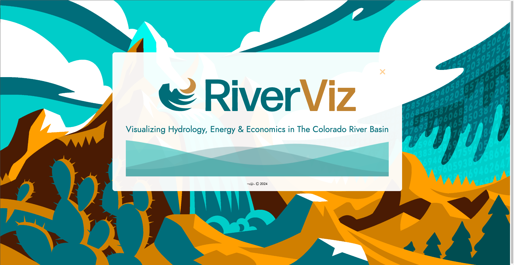
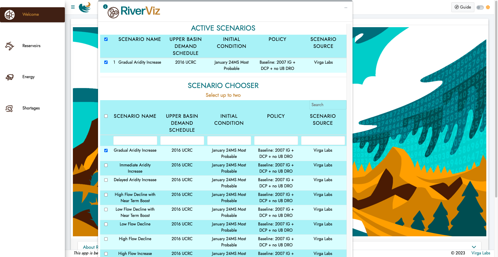
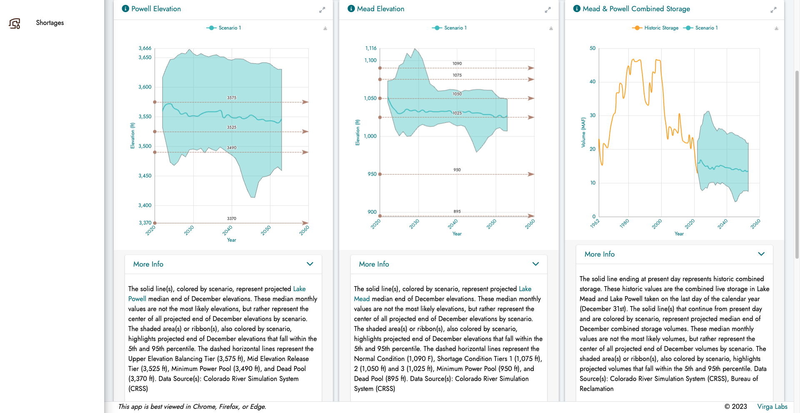

```{r setup, include=FALSE}
knitr::opts_chunk$set(echo = FALSE)
```

{width="100%"}

# Overview

This is a walk-through of the work that I did on a project called RiverViz while working on the Virga Labs team from July of 2022 through May of 2024. This tool was built for Arizona State University to democratize access to Colorado River Simulation System (CRSS) model results through approachable formats. The tool provides three different dashboards to explore projected reservoir conditions, energy generation potential, and water supply availability in the Colorado River Basin. A link to the tool itself can be found [here](https://www.riverviz.io/), and it can be explored by anyone! This walk-through is more intended to showcase the work that I personally did while working on this project, and is less intended to showcase the whole tool itself. If you would like to learn more about the whole tool and what it is capable of, I recommending going to the website and making an account and exploring the tool for yourself!

# My Main Contributions

### UI Changes

Throughout this project I helped work on much of the UI of the web application. I helped design the layout of the scenario chooser and I helped with the layouts of the different dashboards. I also helped make changes and adjustments to many of the data visualizations throughout the app as they changed over time.

{width="100%"}

### Explanatory Content

Each data visualization in this plot comes with a drop down section underneath it that explains what the graph is showing. A colleague and I spent time going through each visual and making sure that the explanations were both accurate and helpful.

{width="100%"}

### Data Validation

The largest task that I worked on for this project was data validation. When I was first brought onto this project many of the visualizations were already developed. But, my first task was to go through each visual and check the SQL query that was being used to get the data for that visual. This involved navigating code written by others and finding in-house functions that enabled the display of the SQL queries. Once I was able to see each query for each visual I then had to go through and make sure the SQL code was correct and that it was in fact returning the data that we wanted in order to display what we were saying the plots were displaying. CRSS has many different tables that it contains so I also had to do a lot of checking with my manager and other colleague to check the raw data itself. Any errors that I did find I would then need to check with our backend engineer and assist in correcting the queries to return what we actually wanted. This was a difficult task but ultimately I enjoyed because it helped me learn a lot about SQL and the importance of data validation. It's too easy to create a data visualization that isn't actually accurate, so it's so important to make sure that everything is correct before releasing it to the public.
